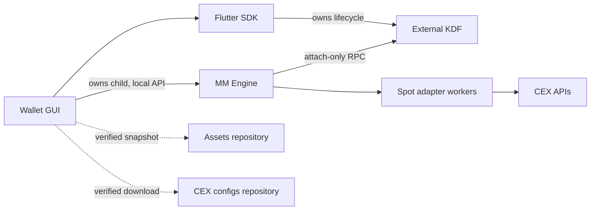

# P2Pirate wallet: AI and contributor project guide

Start with [AGENTS.md](../AGENTS.md). Fact-checked on 2026-10-06 against the
source revision recorded there. This is an orientation to the current fork,
not authorization to operate a real wallet.

## What this application is

P2Pirate-ALPHA is the Flutter desktop wallet/DEX fork preserving CheetahDEX
history. Its reviewed development/release recipe targets Linux x86-64. macOS and
Windows are intended desktop targets needing their own native-host acceptance;
iOS is historical, and Android/Web app runners were removed. Do not transfer the
upstream SDK's broad platform claims to this application's release status.

The GUI is one component of a five-repository system:

| Component | Responsibility |
| --- | --- |
| [Flutter SDK](https://github.com/p2piratedotcom/komodo-defi-sdk-flutter/blob/cheetahdex/AGENTS.md) | KDF lifecycle/client, auth, assets, balances, typed RPC and reusable UI |
| [MM_Engine](https://github.com/p2piratedotcom/MM_Engine/blob/main/AGENTS.md) | Maker pricing/sizing, reservations, reconciliation, hedge/rebalance policy |
| [CEX_configs](https://github.com/p2piratedotcom/CEX_configs/blob/main/AGENTS.md) | Downloadable executable Spot adapters and public settings |
| [Assets](https://github.com/p2piratedotcom/Assets/blob/main/AGENTS.md) | Commit-versioned coin/node configuration and artwork inventory |
| This wallet | Interface, consent, profile selection, process ownership and verified updates |

Rust KDF is an external executable, not code maintained in any of these five
repositories. Linux uses a verified KDF 2.7 installation; the checksum/source
record is in [external KDF](P2PIRATE_EXTERNAL_KDF.md). A Dart SDK gitlink and a KDF
binary version are different dependencies.



Tor is a wallet-owned transport when enabled, including routed outbound CEX
traffic. Local KDF/engine RPC remains loopback. Explicit direct mode is a user
choice; failure of a Tor route does not permit a silent direct fallback.

## Read these paths for a change

| Work area | Starting points |
| --- | --- |
| Startup/profile/process lifecycle | `lib/main.dart`, `lib/services/initializer/`, `lib/bloc/auth_bloc/`, `lib/sdk/widgets/window_close_handler.dart` |
| Navigation and page state | `lib/router/`, `lib/views/main_layout/`, `lib/views/wallet/` |
| Wallet assets/activation/balances | `lib/bloc/coins_bloc/`, `lib/bloc/coins_manager/`, SDK public managers |
| Ordinary DEX submission | `lib/bloc/taker_form/taker_bloc.dart`, `taker_validator.dart`, `lib/bloc/dex_repository.dart`, `lib/views/dex/` |
| Bridge | `lib/bloc/bridge_form/`, `lib/views/bridge/` |
| Engine lifecycle/install/HTTP | `lib/services/mm_engine/mm_engine_service.dart`, `mm_engine_install_service.dart`, `mm_engine_http_client.dart` |
| Engine rendering/forms | `lib/views/market_maker_bot/market_maker_bot_page.dart`, `mm_engine_dashboard.dart`, `mm_engine_rebalance_panel.dart`, `mm_engine_strategy_form.dart` |
| Public asset download | `lib/services/coin_assets/coin_assets_service.dart` |
| Tor and routed HTTP | `lib/services/tor/` |
| Native renderer/packaging | `linux/my_application.cc`, `scripts/`, `licenses/` |

App state uses BLoC and services; SDK and local package dependencies are declared
in `pubspec.yaml`. The `web_dex` package name and some legacy storage/type names
are compatibility names, not evidence the removed Web target is supported.
Historical maker classes remain because shared UI uses them; do not reactivate
an independent legacy publishing loop alongside MM_Engine.

## Main flows and distinctions

1. **Startup:** load verified fallback/downloaded assets and explicit routing;
   provision/locate external KDF; initialize SDK. An installed executable or
   running process is not an authenticated, synchronized wallet.
2. **Wallet:** auth, asset activation and account-scoped balance streams are
   orchestrated through SDK. Unknown/activating balances are not zero. KDF IDs
   retain case-sensitive network suffixes; exchange aliases are a separate map.
3. **Ordinary Swap/Bridge:** form input, preview/fees, validation, confirmation,
   submission and uncertain-result recovery are different states. Keep drafts
   across ordinary navigation but do not reuse derived confirmation data as a
   fresh quote or retry an uncertain funded submission.
   The desktop Taker Swap book shows only the selectable green Buy-side panel
   for the selected Sell/Buy coin pair. Reversing the pair requests the opposite
   book; a reply for the previous pair is never left selectable while loading.
   Price/volume units and UUID matching stay in the selected book's orientation.
   Offer rows include available quantity, native unit/total prices and optional
   USD unit/total estimates. Totals use the full available offer and exclude swap
   fees. Rational native calculations never feed rounded display values into
   submission. Header/value tooltips explain units, minimums and precision, displaying at most eight decimal places with approximation markers; a
   missing USD reference is unavailable, not zero. USD display follows Settings.
   Narrow panels scroll headings and data together to retain column alignment.
4. **Trading Engine:** install verification, showing the page, preview, live
   permission, saving a paused strategy and starting selected makers are separate
   actions. New profiles default to non-live behavior. Previously approved live
   preferences and enabled makers may be restored at login: use disposable
   profiles, not a real account, for development startup.
5. **CEX rebalance:** the independent CEX REBALANCE card selects venue, makers,
   funding assets and percentages. Local ideal reference, real balances and
   attainable funding are separate. Execution confirms a single funded LIMIT
   step, with backend revalidation. Partial coverage is not maker authorization.
6. **Stop/update:** require reconciliation and a successful engine stop report;
   retain KDF/Tor for recovery if owned orders/swaps cannot be resolved. Engine
   swap counters cover engine-owned swaps, not every wallet taker swap.

The GUI is a client of the [wallet protocol](https://github.com/p2piratedotcom/MM_Engine/blob/main/docs/WALLET_INTEGRATION.md),
not the risk-policy owner. It sends bootstrap secrets through stdin and uses an
in-memory token for the authenticated loopback API. Credential status endpoints
return availability, not secret values; user CEX secrets are stored in Linux
Secret Service. Worker permissions remain distinct from GUI permissions. The common Spot worker
needs at least one credentialed supported client; each chosen venue must pass its
own permission/readiness checks. Historical MEXC-only wording in older integration
docs is not authoritative over the current worker/catalog implementation.

Display memory is scoped to wallet/process and keeps original timestamps.
Reconnection/live-mode changes fence old replies before adopting new snapshots.
Showing a cached row must not authorize a start. Pause/Stop can remain available
when status is stale. English presentation translates legacy diagnostics without
changing their source values, logs or machine confirmation payloads. See
[GUI navigation](GUI_NAVIGATION_PERFORMANCE.md) and
[English diagnostics](GUI_ENGLISH_DIAGNOSTICS.md).

See [GUI task clarity and recovery](GUI_AUDIT_HARDENING.md) for native switch
semantics, retained maker drafts, async recovery and the Details/Swap/rebalance
presentation. Display formatting keeps exact values available and never changes
confirmed execution quantities/prices.

## Setup and validation, safely

Inspect `pubspec.yaml` for toolchain constraints (at review: Flutter >=3.47.5
and Dart >=3.11.0, both below 4). Initialize the exact SDK gitlink:

```sh
git submodule sync --recursive
git submodule update --init --recursive
git ls-tree HEAD sdk
git -C sdk rev-parse HEAD
```

The last two SHAs must match. Do not use `git submodule update --remote` to repair
a clone. The SDK's current default branch can differ from this pin. Historical
pin values in older docs are not authoritative over `git ls-tree HEAD sdk`.
A behavior change there needs its own SDK PR and explicit wallet pin PR.

Resolve SDK workspace dependencies using its manifests, then wallet dependencies:

```sh
dart pub get -C sdk
flutter pub get --enforce-lockfile
```

This SDK workspace currently has no committed root `pubspec.lock`; do not require
an absent lockfile or substitute a different branch to obtain one. Offline mode
is appropriate only with dependencies already cached.

For approved code work, representative commands are:

```sh
dart format path/to/changed_file.dart
flutter analyze --no-fatal-warnings --no-fatal-infos
flutter test test_units
# Native smoke fixture: disposable directories and D-Bus; does not start KDF.
dart run_integration_tests.dart
```

Only the explicitly opted-in fixture starts KDF:

```sh
P2PIRATE_KDF_PATH=/absolute/path/to/reviewed/kdf dart run_integration_tests.dart --kdf
```

Read [integration testing](INTEGRATION_TESTING.md) before either target. Historical
browser tests are not safe to run against a live wallet. Tests/builds and account
readiness do not prove funded swap/hedge acceptance.

`flutter build linux --release --no-pub` builds the GUI, not KDF or MM_Engine.
For an explicitly isolated developer launch use `flutter run -d linux
--no-enable-impeller`; do not run that against an existing profile. Follow
[INSTALL.md](../INSTALL.md) and [AppImage packaging](P2PIRATE_APPIMAGE.md) for native
prerequisites, staged catalog, Tor source/notices and pinned packaging tools.
Preserve Impeller disabled in the compiled Linux runner. macOS/Windows commands
are intentions, not proof of accepted binaries.

## Downloads, trust and supported boundaries

- Engine downloads require expected repository identity, immutable-release
  metadata, compatibility and asset digests. Installation/download is not a live
  permission. Source changes do not hot-update a running engine.
- CEX plugin downloads first load only the public commit-pinned catalog. The
  user selects exchanges with no default selection; only selected adapter/config
  files are downloaded. Unselected installed plugins are copied unchanged into
  the new verified snapshot, retaining their source commits. Empty/cancelled
  selections do not stop the engine or install files. Identical selected plugins
  report up to date without migrating the engine. See
  [selective plugin downloads](CEX_PLUGIN_DOWNLOAD_SELECTION.md).
- Plugin snapshots are executable Python code, pinned/verified against their
  catalog. Child processes are not OS security sandboxes. Experimental venues
  remain explicitly untested against live accounts/funded orders.
- Assets updates require consent, commit/hash/path/size verification and staged
  activation. The reviewed bundled JSON fallback remains available; absent
  artwork can use a local badge. Tor-mode node behavior and downloaded node
  data are not assumed interchangeable: inspect the SDK source.
- The source is an experimental port, not a claim all listed chains/platforms,
  funded operations or release recipes are production-validated.
- Persisted private profiles, journals/keyring identity and legacy app-data names
  survive upgrades. Never reset/delete them to hide a timeout or an old state.
- Retain GPL-3.0 history/notices and distinct component/artwork rights. A downloaded
  icon or a reference ZIP does not create redistribution rights.

## First troubleshooting pass

Separate GUI display age, engine snapshot readiness, KDF authentication/RPC,
coin activation, P2P peers, Tor reachability, CEX market timestamps, funding and
GPU health. A peer count, `/health`, successful HTTP request or process presence
alone is not trading readiness. A mutating KDF timeout may have published an
order; never send it again merely because the GUI timed out. Quote/order and
strategy identities must be traced by UUID/ID rather than pair alone.

For pauses, distinguish a manual pause, WAITING, cooldown, STABILIZING while the
same UUID stays OPEN, real withdrawal/republication and an in-place price change.
Use allowlisted diagnostic metadata and report gaps/rotation. A metadata sample
table does not capture every feed update. Do not blame Tor, KDF or the renderer
from correlation alone; Xid/OOM and read/write latency are separate evidence.

## Further reading

- [MM Engine integration](P2PIRATE_MM_ENGINE.md)
- [Exchange porting](MM_ENGINE_EXCHANGE_PORTING.md)
- [Tor](P2PIRATE_TOR_LINUX.md), [renderer stability](LINUX_RENDERER_STABILITY.md)
- [External KDF](P2PIRATE_EXTERNAL_KDF.md), [assets](P2PIRATE_ASSETS.md)
- [Desktop scope](DESKTOP_ONLY_SCOPE.md), [porting status](P2PIRATE_PORTING_STATUS.md)
- [Build provenance](LINUX_ASSET_PROVENANCE.md), [test status](TEST_STATUS.md)

## A safe starting prompt for an AI contributor

```text
Read AGENTS.md and docs/AI_PROJECT_GUIDE.md at this checkout's revision.
My task is: [describe the requested change].
Identify the component boundary, relevant source/contracts, current limitations,
validation appropriate to this scope, and whether these guides need updating.
Use disposable fixtures; do not start a real wallet/service or submit funded
operations without the operator's explicit authorization.
Report facts separately from assumptions and checks performed from checks not run.
```

## Maintenance and PR handoff

Recheck this guide and `AGENTS.md` in the same PR when architecture, public
contracts, ownership, safety, persistence, routing, supported platforms,
dependencies, setup/tests, generated outputs, provenance or acceptance limits
change. Update linked specifications too when their contract changed. The PR
maintenance checklist requires either the corresponding edits or an explicit
no-update reason; a checkbox alone does not make an old statement true.

Keep version claims dated and tied to source/release evidence. Do not copy a local
runtime path, user account, balance, API credential or private monitoring result
into public guidance. Prefer links to manifests/constants over repeated moving
pins or exhaustive API copies. A cross-repository change needs companion PRs and
compatibility notes; do not assume that merging one repo deploys the whole system.

A useful AI handoff states: repository and commit, requested scope, relevant
modules/contracts, proposed change, risks, exact checks actually performed,
checks not run, companion repositories affected, and guide sections updated.
Implementation, fixture tests, a compatible release, installation, startup,
read-only account validation and funded acceptance are separate milestones.


## Optional maker hedging candidate

[Optional hedging/shared coverage](OPTIONAL_HEDGING_SHARED_COVERAGE.md) describes
capability negotiation, immutable switches, drafts, risk wording and unknown
balances. Mathematical/authorization decisions remain in MM_Engine; the GUI does
not infer funding or perform a rebalance while displaying these snapshots.

Swap offer discovery preserves a peer-no-response failure as unavailable, rather than treating it as successful empty liquidity. The best_orders HTTP wrapper reads only the known peer failure category from the SDK response message and presents fixed English copy; generic HTTP failures retain only the numeric status. An empty directional taker book shows an unavailable message while discovery has failed; populated book rows remain usable and ordinary swap validation remains mandatory. This does not repair peer connectivity or change the pinned SDK.

Taker Swap names its selectors “Asset I want to sell” and “Asset I want to buy”. Available offers use separated, selectable rows with 16px amounts, 14px column labels, visible selected state and preserved UUID copy/tooltips. The list removes the enclosing book box and histogram fill, sizes to its content up to six visible offers, then scrolls vertically; native/USD columns scroll together horizontally when needed. Legacy maker books retain their book presentation.
